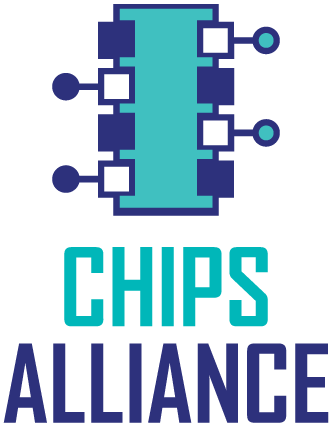
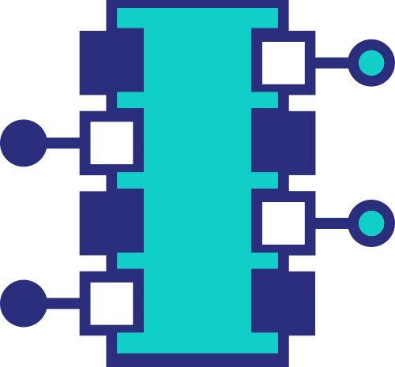
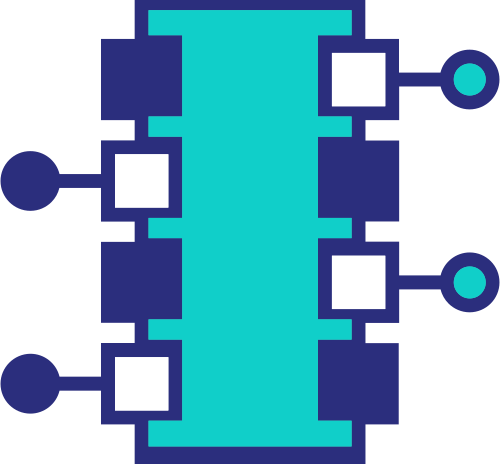
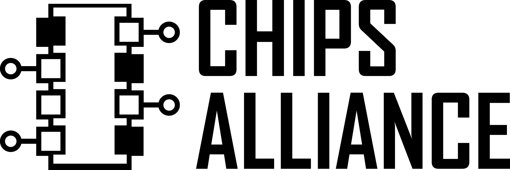
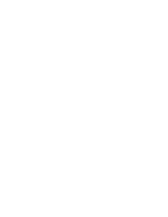
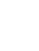
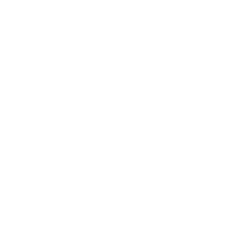

# CHIPS Alliance Artwork and Logos

*Note: GitHub Flavored Markdown used in the Readme doesn't support background colors. The white logos below are displayed on the light grey of tables.*


## CHIPS Alliance

* [Brand guidelines](./chipsalliance/CHIPS_Alliance-Brand_guidelines.pdf)

### Color Palette

<table style="text-align:center">
	<tr>
		<th colspan=3>
	</tr>
		<th></th>
		<th width="150">RGB</th>
		<th width="150">CMYK</th>
		<th width="150">Pantone</th>
		<th width="150">Hex</th>
	</tr>
		<td></td>
		<td>(200, 200, 200)</td>
		<td>(20, 17, 17, 0)</td>
		<td>420 C</td>
		<td>#C8C8C8</td>
	</tr>
	</tr>
		<td></td>
		<td>(16, 207, 201)</td>
		<td>(66, 0, 29, 0)</td>
		<td>3252 C</td>
		<td>#10CFC9</td>
	</tr>
	</tr>
		<td></td>
		<td>(18, 38, 170)</td>
		<td>(99, 93, 0, 0)</td>
		<td>2736 C</td>
		<td>#1226AA</td>
	</tr>

</table>

### Logos

<table>
    <tr>
    	<th colspan="7"></th>
    </tr>
    <tr>
        <th></th>
        <th colspan="3">PNG</th>
        <th colspan="3">SVG</th>
    </tr>
    <tr>
        <th></th>
        <th>horizontal</th>
        <th>stacked</th>
        <th>icon</th>
        <th>horizontal</th>
        <th>stacked</th>
        <th>icon</th>
    </tr>
    <tr>
        <th>color</th>
        <td></td>
        <td></td>
        <td></td>
        <td></td>
        <td></td>
        <td></td>
    </tr>
    <tr>
        <th>grayscale</th>
        <td></td>
        <td></td>
        <td></td>
        <td></td>
        <td></td>
        <td></td>
    </tr>
    <tr>
        <th>white</th>
        <td></td>
        <td></td>
        <td></td>
        <td></td>
        <td></td>
        <td></td>
    </tr>
</table>

### ASCII Art

```
    __
  []  []-o CHIPS
o-[]  []
  []  []-o ALLIANCE
o-[]__[]
```

---

Use of any trademark or logo is subject to the trademark policy available at [https://www.linuxfoundation.org/trademark-usage](https://www.linuxfoundation.org/trademark-usage)

Questions? Please email [trademark@chipsalliance.org](mailto:trademark@chipsalliance.org).
